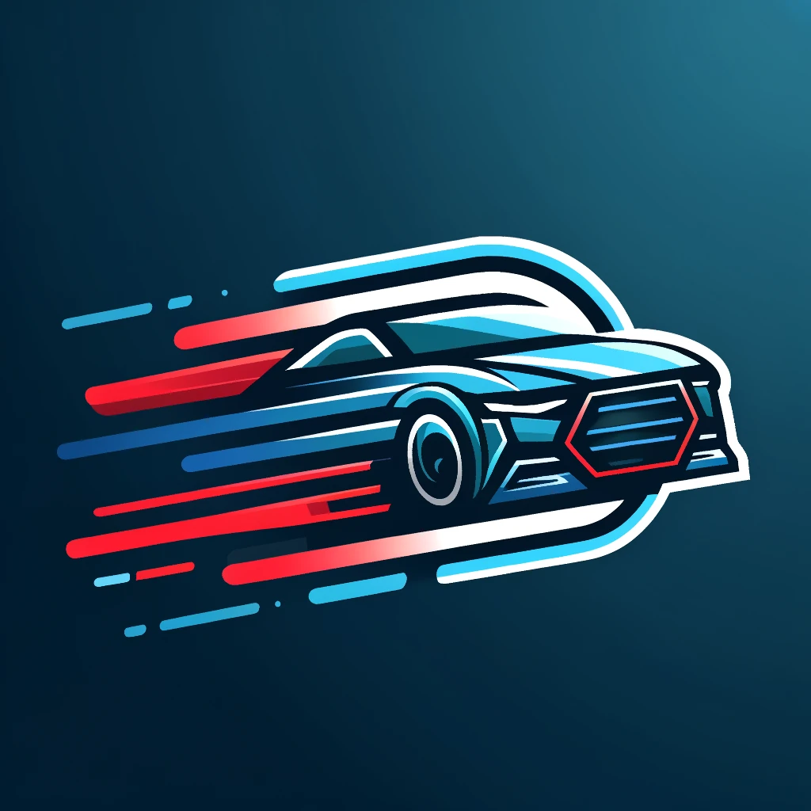

# EscapeRacer

Welcome to **EscapeRacer**, the thrilling car-themed game where your goal is to dodge obstacles and race to the finish line! Test your reflexes and driving skills in this high-speed adventure.

## Features

- **Intuitive Controls**: Easy-to-use controls that make the game accessible for all ages.
- **Stunning Graphics**: Enjoy vibrant and eye-catching visuals.
- **Background Music**: Enjoy a fade version of Alan Walker's music while playing.
- **Game Modes**: Choose from three exciting game modes in the main menu:
  1. **2 Button Mode - Slow**: Control your car using two buttons for left and right movement at a slower pace, ideal for beginners.
  2. **2 Button Mode - Fast**: Control your car using two buttons for left and right movement at a faster pace, for more experienced players.
  3. **Sensor Mode**: Control your car by tilting your device, using the built-in sensors for a more immersive experience.
- **Coin Collection**: Collect coins along the way and track the number of coins you have gathered at the top of the screen.
- **Odometer Display**: Keep an eye on your duration at the top of the screen.
- **Sound Effects**: Enjoy a crash sound when you hit a rock and a pleasant sound when you collect a coin.

## Demo Video

Check out this demo of the game:

## How to Play

1. **Start the Game**: Just launch the app and the main menu will appear.
2. **Select Game Mode**: Choose from 2 Button Mode - Slow, 2 Button Mode - Fast, or Sensor Mode.
3. **Control Your Car**: Use the left and right arrows or your device sensor to steer your car.
4. **Dodge Obstacles**: Avoid rocks in your path.
5. **Collect Coins**: Gather coins along the way to boost your score.
6. **Lives System**: The player starts the game with three lives (three hearts). Each collision with a rock reduces the lives by one. When lives reach zero, it's game over.
7. **Collision Effects**: On each collision with a rock, the device vibrates, a crash sound plays, and a toast message "Oops" appears on the screen.
8. **Game Over**: After a game over, you can start a new game.

## Development

EscapeRacer is developed using Android Studio. Below are the key components of the project:

- **MainActivity**: Handles the main game logic and user interactions.
- **GameOverActivity**: Manages the game over logic and allows players to start a new game.
- **MenuActivity**: Responsible for displaying the menu to the user.
- **GameManager**: Manages the overall game state, including initializing the game, updating the game loop, handling collisions, and managing the player's lives and score.
- **moveCallback Interface**: Defines the methods for handling movement detection.
- **moveDetector Utility**: Detects device movements to the left or right using the sensor.
- **SoundPlayer Utility**: Manages the sound effects within the game.

Thank you for playing EscapeRacer! We hope you enjoy the game as much as we enjoyed creating it.
