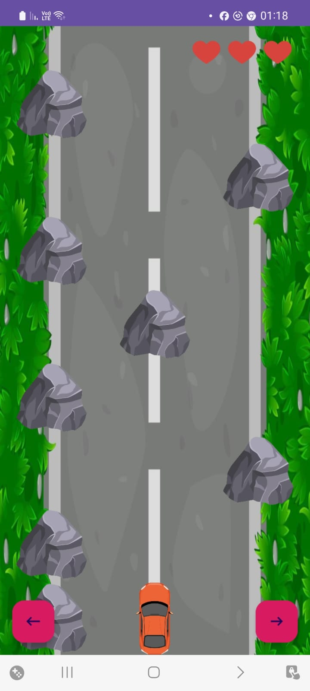
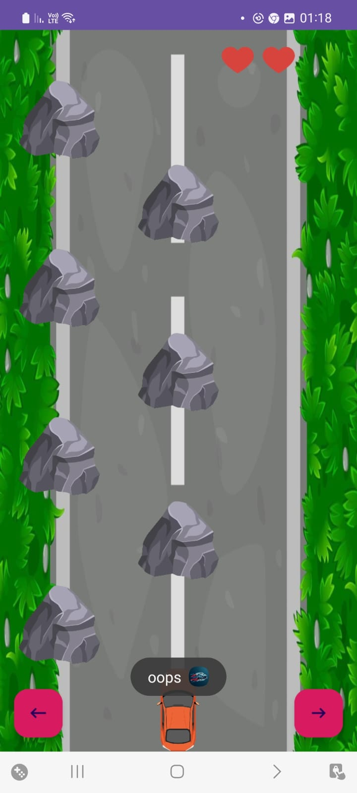
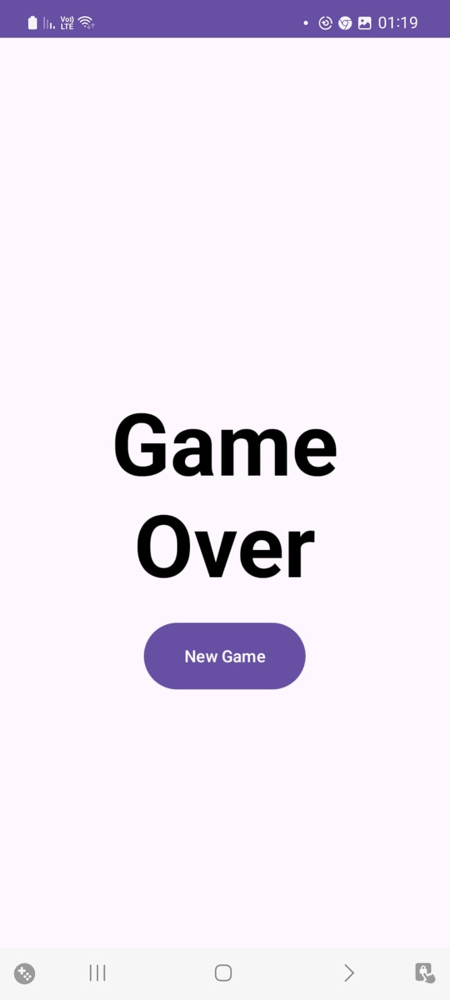

# EscapeRacer

Welcome to **EscapeRacer**, the thrilling car-themed game where your goal is to dodge obstacles and race to the finish line! Test your reflexes and driving skills in this high-speed adventure.

## Features

- **High-Speed Action**: As time passes, the speed at which obstacles approach increases.
- **Intuitive Controls**: Easy-to-use controls that make the game accessible for all ages.
- **Stunning Graphics**: Enjoy vibrant and eye-catching visuals.
- **Background Music**: Enjoy a fade version of Alan Walker's music while playing.

## Demo Video

Check out this demo of the game:

## How to Play

1. **Start the Game**: Just launch the app and the game will start.
2. **Control Your Car**: Use the left and right arrows to steer your car.
3. **Dodge Obstacles**: Avoid rocks in your path.
4. **Lives System**: The player starts the game with three lives (three hearts). Each collision with a rock reduces the lives by one. When lives reach zero, it's game over.
5. **Collision Effects**: On each collision with a rock, the device vibrates, and a toast message "Oops" appears on the screen.
6. **Game Over**: After a game over, you can start a new game.

## Development

EscapeRacer is developed using Android Studio. Below are the key components of the project:

- **MainActivity**: Handles the main game logic and user interactions.
- **GameOverActivity**: Handles the game over logic and allows players to start a new game.
- **GameManager**: Manages the overall game state, including initializing the game, updating the game loop, handling collisions, and managing the player's lives and score.

## Screenshots

*Game state after launch*

*One collision, lives reduced from 3 to 2*

*Game Over*

Thank you for playing EscapeRacer! We hope you enjoy the game as much as we enjoyed creating it.
